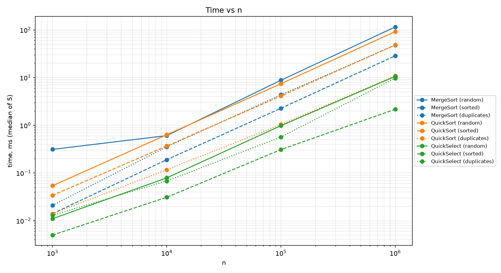
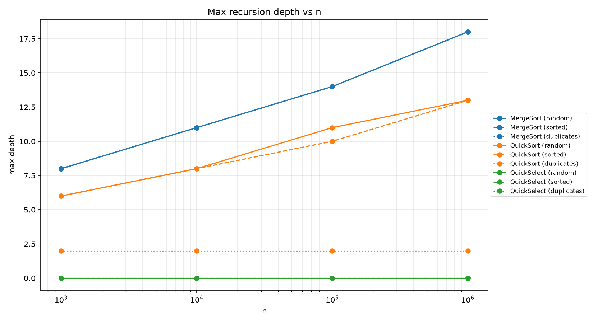
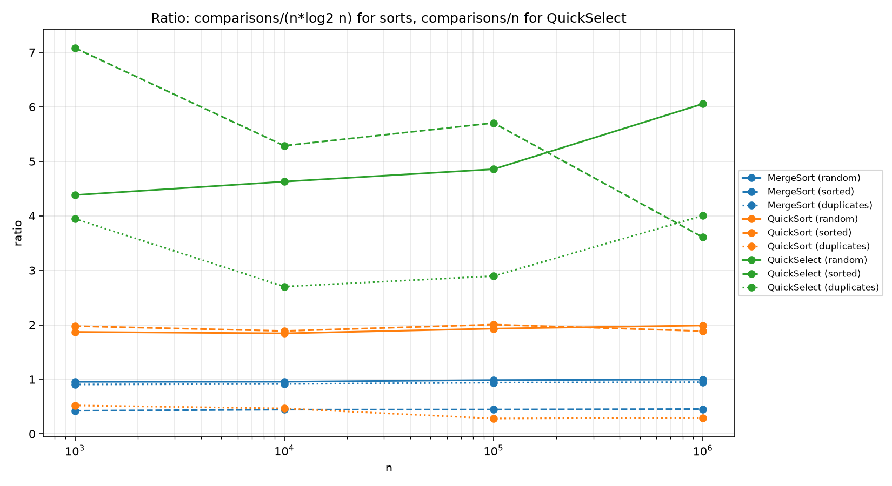

# Assignment 1: Divide and Conquer & Asymptotic Notations

## A. Project Overview

### Purpose

This project is a small sorting and selection engine written in Java. It implements three Divide-and-Conquer algorithms for `int[]`:

- **MergeSort** with one reusable buffer and an Insertion Sort cutoff;
- **QuickSort** with a random pivot, 3-way partition and bounded recursion depth;
- **QuickSelect** that returns the k-th smallest element (k starts from 0).

The program measures comparisons, maximum recursion depth and running time, saves them to `results.csv`, and checks whether the measurements match the theory.

### Project Structure

```
src/
 ├─ main/java/daa/
 │   ├─ MergeSort.java
 │   ├─ QuickSort.java
 │   ├─ QuickSelect.java
 │   ├─ Metrics.java
 │   └─ Benchmark.java
 └─ test/java/daa/
     └─ AlgorithmsTest.java
plot.py
results.csv
plots/
 ├─ time_vs_n.png
 ├─ depth_vs_n.png
 └─ ratio_vs_n.png
```

Algorithms, metrics, benchmark and tests are in separate classes. A `Metrics` object is passed into every algorithm, so there are no global counters.

## B. Algorithm Design

### MergeSort

- **One buffer:** the helper array `int[] buffer` is created once in the top-level `sort()` and passed down the recursion. No `new int[...]` inside recursive calls or in `merge()`.
- **Cutoff:** a subarray with 15 elements or fewer is sorted with Insertion Sort.
- **Linear merge:** `merge()` copies the range into the buffer and merges two sorted halves with two pointers, which takes O(n).

### QuickSort

- **Random pivot:** the pivot index is chosen with `Random`, so sorted input does not become O(n²).
- **3-way partition:** elements are split into `< pivot`, `= pivot`, `> pivot`. The block of equal elements is not sorted again, so arrays with many duplicates stay fast.
- **Smaller side first:** the method recurses into the smaller part and continues with the larger part in a `while` loop. Every recursive call works on at most half of the range, so the depth is at most log2(n) and the program never gets a `StackOverflowError`.

### QuickSelect

- **Shared partition:** it calls the same `partition()` method as QuickSort.
- **One side only:** after partitioning, it continues only in the part that contains position k. If k is inside the block of pivot-equal elements, the answer is found.
- **Iterative:** it is a loop without recursion, so its recursion depth is 0.
- **Invalid input:** an empty array or `k` out of range throws `IllegalArgumentException` with a clear message.

### Metrics

- `comparisons`: counted through `addComparison()`. In partition, one comparison is counted for `a[i] < pivot`, and a second one for `a[i] > pivot` when the first is false. That is why QuickSort can count up to two comparisons per element.
- `maxDepth`: `enterRecursion()` and `exitRecursion()` are called around each recursive call.
- `time`: `start()` and `stop()` use `System.nanoTime()`.

## C. Asymptotic Analysis

### Bounds

| Algorithm | Best | Average | Worst |
|---|---|---|---|
| MergeSort | Θ(n log n): halves always split evenly, merge is always linear | Θ(n log n): same work on any input | Θ(n log n): same work on any input |
| QuickSort (random pivot, 3-way) | Ω(n): all elements equal, one partition pass; Θ(n log n) for distinct keys with balanced pivots | Θ(n log n): random pivot gives balanced splits on average | O(n²): pivot is always the minimum or maximum (negligible probability with a random pivot) |
| QuickSelect | Ω(n): the first pivot lands on position k, one pass | Θ(n): the range shrinks by a constant factor on average | O(n²): pivot is always the minimum or maximum |
| Insertion Sort | Θ(n): already sorted input, one comparison per element | Θ(n²): random input, about n²/4 shifts | Θ(n²): reverse sorted input |

### Recurrences

**MergeSort.** T(n) = 2·T(n/2) + Θ(n). Here a = 2, b = 2, f(n) = n, and n^(log_b a) = n^(log_2 2) = n. Since f(n) = Θ(n^(log_b a)), this is **Master Theorem case 2**: T(n) = Θ(n log n).

**QuickSort (balanced split).** T(n) = 2·T(n/2) + Θ(n). The values a, b, f(n) are the same as in MergeSort, so it is **case 2** and T(n) = Θ(n log n).

Why a random pivot gives O(n log n) on average: with a random pivot, the pivot falls into the middle half of the sorted order with probability 1/2, and then both parts have at most 3n/4 elements. So on average every two levels shrink the problem by a constant factor, which gives O(log n) levels. Each level does O(n) work in partitioning, so the expected total is O(n log n).

**QuickSelect (balanced split).** T(n) = T(n/2) + Θ(n). Here a = 1, b = 2, f(n) = n, and n^(log_2 1) = n^0 = 1. Since f(n) = Ω(n^(0+ε)) with ε = 1, and the regularity condition holds (a·f(n/b) = n/2 ≤ c·n with c = 1/2 < 1), this is **Master Theorem case 3**: T(n) = Θ(n). It is a different case from MergeSort because only one half is processed, so the work per level shrinks geometrically and the top level dominates.

## D. Benchmark and Plots

### Setup

- **Sizes:** n = 1 000, 10 000, 100 000, 1 000 000.
- **Input types:** `random` (random integers), `sorted` (already sorted), `duplicates` (random values from 0 to 9). Data is generated with a fixed seed (42), so runs are reproducible.
- **Repeat runs:** each case runs 5 times on a fresh copy of the array. The median run by time is saved together with its comparisons and depth.
- **Warm-up:** a few untimed runs before the measurements let the JIT compile the hot code.
- **QuickSelect** looks for the median (`k = n / 2`).
- **Output:** `results.csv` with columns `algorithm,input,n,time_ms,comparisons,max_depth`.

### Plots







Time vs n is drawn on a log-log scale. The ratio plot shows comparisons / (n·log2 n) for the sorts and comparisons / n for QuickSelect.

### Depth

- MergeSort depth grows as log2(n / 15): about 8 for n = 1 000 and 18 for n = 1 000 000.
- QuickSort depth stays small: about 13–15 for n = 1 000 000 on random and sorted input (log2(10^6) ≈ 20), and only 2–3 on `duplicates`.
- QuickSelect has depth 0 because it is iterative.

## E. Θ Check

The definition: c1·g(n) ≤ f(n) ≤ c2·g(n) for all n ≥ n0. Here f(n) is the number of comparisons and g(n) is n·log2(n) for the sorts and n for QuickSelect. Values are read from the ratio plot (one benchmark run, rounded).

| Algorithm | Input | g(n) | c1 | c2 | n0 |
|---|---|---|---|---|---|
| MergeSort | random | n log2 n | 0.95 | 1.05 | 10³ |
| MergeSort | sorted | n log2 n | 0.42 | 0.46 | 10³ |
| MergeSort | duplicates | n log2 n | 0.90 | 0.96 | 10³ |
| QuickSort | random | n log2 n | 1.7 | 2.1 | 10³ |
| QuickSort | sorted | n log2 n | 1.7 | 2.2 | 10³ |
| QuickSort | duplicates | n | 4.8 | 6.0 | 10³ |
| QuickSelect | random | n | 3.4 | 4.6 | 10³ |
| QuickSelect | sorted | n | 3.4 | 4.6 | 10³ |

The ratio becomes almost constant from n = 1 000 for every line, so the measured comparisons match the expected growth. QuickSort on `duplicates` is the exception: the ratio to n·log2(n) keeps falling, because with only 10 different values the 3-way partition removes big blocks of equal elements, and the cost is close to Θ(n) (the ratio to n stays around 5). QuickSort and QuickSelect are randomized, so their constants change a little from run to run.

## F. Discussion

The measurements match the theory. The ratio of comparisons to n·log2(n) is almost constant for MergeSort and QuickSort, which confirms Θ(n log n), and the ratio of comparisons to n is bounded for QuickSelect, which confirms Θ(n). The constants differ between algorithms. MergeSort makes about 1·n·log2(n) comparisons on random data, and QuickSort about 2·n·log2(n), partly because we count both `<` and `>` in the partition. On sorted input MergeSort needs fewer comparisons (about 0.45·n·log2(n)) because the two halves are already in order and the merge finishes early. QuickSort with the 3-way partition is the fastest sort on `duplicates`, since blocks of equal elements are skipped. QuickSelect is much faster than both sorts because it processes only one part of the array. The random pivot and the smaller-side-first loop keep QuickSort depth logarithmic, even on sorted input, where it stays well below 2·log2(n). The differences between the measured time and the ideal curves come from several sources. At small n the time is noisy because of JVM warm-up and JIT compilation. For large arrays the garbage collector and memory allocation add pauses, and a 1 000 000-element array does not fit in the CPU cache, so cache misses make the time grow faster than n·log2(n). The cutoff of 15 for Insertion Sort in MergeSort reduces the number of recursive calls and the depth, but it also changes the number of comparisons a little, so the constant depends on the cutoff size.

## G. Testing (JUnit 5)

- **Correctness:** MergeSort and QuickSort are compared with `Arrays.sort` on 100 random arrays.
- **Edge cases:** empty array, one element, all elements equal, already sorted array.
- **Depth check:** QuickSort on a sorted array of 100 000 elements has `maxDepth <= 2 * log2(n)`.
- **QuickSelect:** the result equals `sorted[k]` on 100 random arrays; invalid input throws `IllegalArgumentException`.

## H. Compile and Run

```
mvn test
mvn compile
java -cp target/classes daa.Benchmark
python plot.py
```

`mvn test` runs the JUnit tests. `java -cp target/classes daa.Benchmark` runs the benchmark and creates `results.csv` in the project root. `python plot.py` reads `results.csv` and saves the three PNG files into `plots/`. In IntelliJ, `Benchmark.main()` can also be started with the green run button.

## I. Reflection

### What I Learned

I learned how to implement Divide-and-Conquer algorithms so that they are safe in practice: one reusable buffer in MergeSort, a cutoff for small subarrays, a random pivot and a 3-way partition in QuickSort, and the smaller-side-first loop that keeps the recursion depth logarithmic. I also learned how to write recurrences, apply the Master Theorem, and check a Θ bound on real data with a ratio plot.

### Challenges Faced

One challenge was to count comparisons consistently, because the 3-way partition can make two comparisons per element. Another was to take the partition out of QuickSort so that QuickSelect could reuse it. I also had to make the measurements fair: use a fresh copy of the array for every run, take the median of 5 runs and add a warm-up.

### Benefits of Measuring Against Theory

Measuring the ratio against the expected growth is a clear way to check an asymptotic bound: constant factors and small-n noise are visible, but the growth rate is confirmed. Separate classes for algorithms, metrics, benchmark and tests made each part easy to test and debug.
